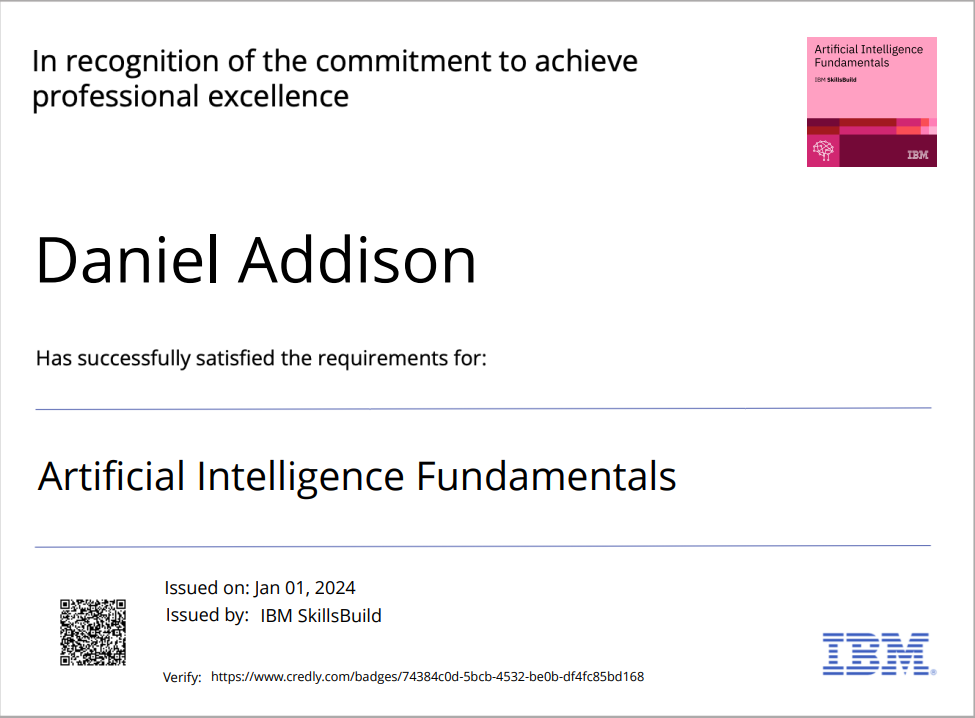
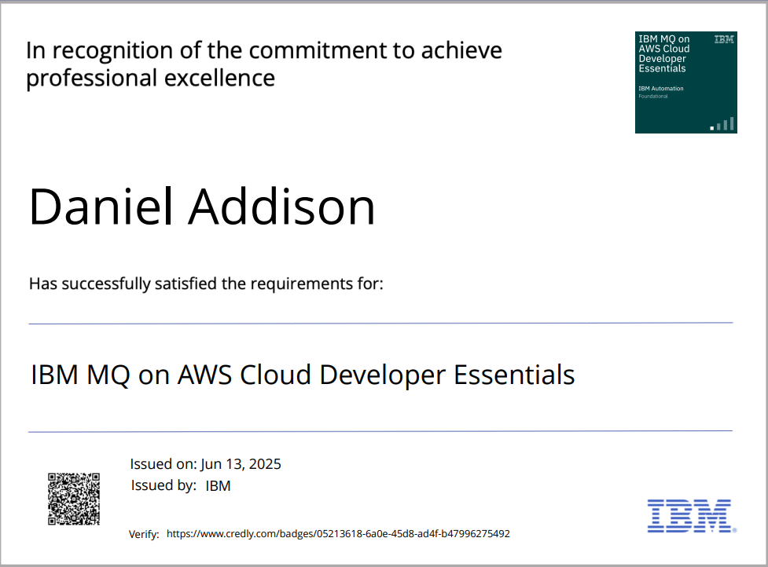

# ✨ Daniel Addison - AI Agent | Scraping | API Integration | Trading | FullStack Developer ✨

### 👉 About Me
 

✨ Ability to write clean, maintainable and efficient code.

✨ Experience in developing dynamic, interactive and user-friendly websites.

✨ Ability to work both independently and collaboratively in a team environment.

✨ Excellent problem-solving skills and attention to detail.

✨ Ability to multitask with strict time constraints, budgets and business goals

✨ Driven to learn and self-improve

✨ A professional who is ensuring a polished final product.

✨ Strong Communication skill!

   

#### AI Agent Development
- **AI/ML Frameworks**: TensorFlow | PyTorch | Scikit-learn | Hugging Face Transformers
- **Natural Language Processing**: OpenAI GPT | Claude | LangChain | Vector Databases
- **Agent Orchestration**: AutoGen | CrewAI | LangGraph | Multi-agent Systems
- **AI Integration**: REST APIs | WebSockets | Real-time Processing

#### Web Scraping & Data Extraction
- **Scraping Tools**: Selenium | BeautifulSoup | Scrapy | Playwright | Puppeteer
- **Data Processing**: Pandas | NumPy | Data Cleaning | ETL Pipelines
- **Anti-Detection**: Proxy Rotation | CAPTCHA Solving | Browser Fingerprinting
- **Scalable Solutions**: Distributed Scraping | Queue Management | Rate Limiting

#### API Integration & Development
- **API Design**: RESTful APIs | GraphQL | WebSocket APIs | Microservices
- **Integration**: Third-party APIs | Payment Gateways | Social Media APIs
- **Authentication**: OAuth | JWT | API Keys | Rate Limiting
- **Documentation**: OpenAPI/Swagger | Postman Collections

#### Trading & Financial Systems
- **Trading Platforms**: Binance | Coinbase | Interactive Brokers | MetaTrader
- **Market Data**: Real-time Feeds | Historical Data | Technical Indicators
- **Algorithmic Trading**: Strategy Development | Backtesting | Risk Management
- **Cryptocurrency**: DeFi Protocols | DEX Integration | Yield Farming
- **Trading Bots**: Copy Trading | Sniper | Arbitrage | MEV bots

#### Website Development
- <b>Front-end</b> :  React.js | Next.js | Gatsby.js | Redux | TailwindCSS | Bootstrap | MUI
- <b>Back-end</b> : Node.js | Express.js | Nest.js | Laravel 
- <b>Database</b> : Mysql | PostgreSQL | MongoDB | IPFS
- <b>CMS</b> : Wordpress | Shopify | Contentful | Headless CMS
- Amazon Web Services (Lambda, EC2, S3, Secret Manager, SNS, SES, Route53, DynamoDB, etc), Google Cloud Platform, Firebase, Supabase and so on

### Skills and Tools:

<code></code>
<code></code>
<code></code>
<code></code>
<code></code>
<code></code>
<code></code>
<code></code>
<code></code>
<code></code>
<code></code>
<code></code>
<code></code>
<code></code>
<code></code>

### Certificates

<table align="center">
  <tr>
    <td align="center" width="50%" style="padding: 20px;">
      
       
      <b>Artificial Intelligence Fundamentals</b>
       
      Credly Badges
    </td>
    <td align="center" width="50%" style="padding: 20px;">
      
       
      <b>Web Development With Python</b>
       
      Credly Badges
    </td>
  </tr>
  <tr>
    <td align="center" width="50%" style="padding: 20px;">
      
       
      <b>Python For Data Science</b>
       
      Credly Badges
    </td>
    <td align="center" width="50%" style="padding: 20px;">
      
       
      <b>IBM MQ on AWS Essentials</b>
       
      Credly Badges
    </td>
  </tr>
</table>